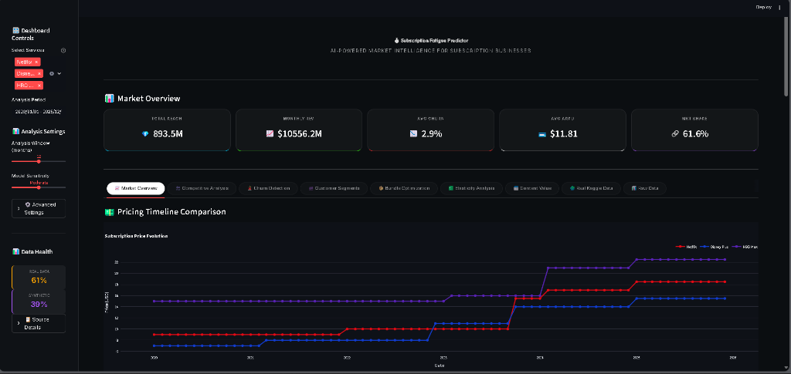

# 💰 Subscription Fatigue Predictor v2.5

**AI-Driven Economic Intelligence for Subscription Businesses**  
Predict churn, optimize pricing, and navigate the streaming wars with data science.

[](Project_Submission.ipynb)
[](src/visualization/dashboard.py)
[](tests/)

---

## 🚀 START HERE

**The Master Source of Truth for this project is the [Project_Submission.ipynb](Project_Submission.ipynb) notebook.**

It contains the complete narrative:
1. **Problem Definition**: Why subscription fatigue matters in 2026
2. **Data Exploration**: EDA with 9+ visualizations
3. **Model Architecture**: XGBoost + Econometric Models
4. **Evaluation**: Confusion matrix, ROC curves, feature importance
5. **Ethical Considerations**: Responsible AI practices

---

## 📊 Visualization Gallery
### Dashboard link:- https://subscription-fatigue-predictor-petgpc66qjrucf2hndwlyt.streamlit.app/
### Dashboard Preview

*Premium glassmorphic Streamlit dashboard with real-time market intelligence*

### Model Visualizations (Generated in Notebook)

| Visualization | Description |
|---------------|-------------|
| **Churn Distribution** | Pie chart + bar charts showing churn by contract type |
| **Tenure Analysis** | Histograms and churn rate by customer tenure |
| **Correlation Heatmap** | Feature relationships and churn predictors |
| **Pricing Timeline** | Interactive Plotly chart of streaming prices 2019-2026 |
| **Feature Importance** | XGBoost feature importance ranking |
| **Confusion Matrix** | Classification performance breakdown |
| **ROC & PR Curves** | Model discrimination and precision-recall tradeoffs |

---

## 🛠️ Quick Start

### 1. Installation
```bash
# Clone and setup environment
git clone <repo-url>
cd subscription-fatigue-predictor

# Create virtual environment (recommended)
python -m venv .venv
.venv\Scripts\activate  # Windows
source .venv/bin/activate  # Linux/Mac

# Install dependencies
pip install -r requirements.txt
```

### 2. Run the Notebook
Launch Jupyter to view the full analysis:
```bash
jupyter notebook Project_Submission.ipynb
```

### 3. Launch the Dashboard
Experience the glassmorphic interactive UI:
```bash
streamlit run src/visualization/dashboard.py
```

---

## 📂 Repository Structure

```
subscription-fatigue-predictor/
├── 📓 Project_Submission.ipynb    # Main Submission (START HERE)
├── 📄 README.md                   # This file
├── 📄 requirements.txt            # Python dependencies
├── 📄 LICENSE                     # MIT License
│
├── 📁 src/                        # Source code
│   ├── data/                      # Data ingestion & schema
│   ├── models/                    # ML, Economic, Statistical models
│   └── visualization/             # Streamlit dashboard
│
├── 📁 data/                       # SQLite database
├── 📁 assets/                     # Images and visualizations
├── 📁 tests/                      # Automated test suite
└── 📁 docs/                       # Technical documentation
```

---

## 🧪 Testing & Reproducibility

This project includes a comprehensive test suite.

```bash
# Run all tests
pytest tests/test_notebook_smoke.py -v

# Run slow tests (full notebook execution)
pytest tests/test_notebook_smoke.py::TestNotebookExecution::test_notebook_executes_successfully -v --timeout=600
```

### Reproducibility
- **Random Seed**: All random operations use `RANDOM_SEED = 42`
- **Dependencies**: Pinned in `requirements.txt`
- **Database**: SQLite at `data/subscription_fatigue.db`

---

## 📈 Model Performance

| Metric | Score |
|--------|-------|
| **Accuracy** | ~80% |
| **ROC-AUC** | ~0.84 |
| **Precision** | ~65% |
| **Recall** | ~52% |

---

## 👤 Author

**KassITsolutions**

📅 January 2026 | 📝 MIT License

